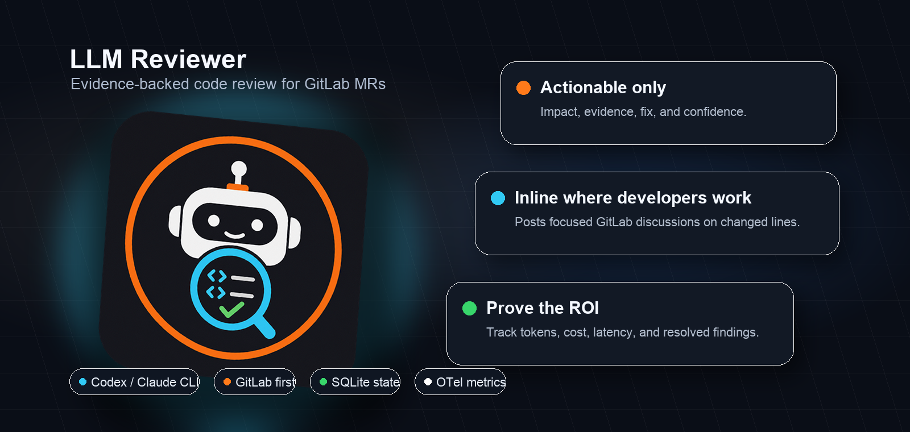
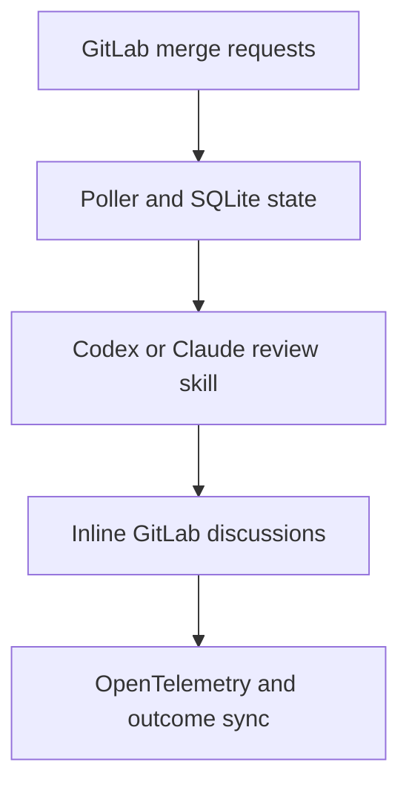

# LLM Reviewer

[](pyproject.toml)
[](pyproject.toml)
[](#gitlab-setup)
[](#telemetry-and-roi)

Evidence-backed LLM code review for GitLab merge requests.



LLM Reviewer watches merge requests, runs a structured Codex or Claude review,
and posts only actionable findings as inline GitLab discussions. It is built for
teams that want early review signal without turning every MR into a chatbot
thread.

## Why Teams Use It

- **Inline comments, not summaries.** Findings are mapped back to changed lines.
- **Evidence-first reviews.** The prompt requires impact, evidence, fix, and
  confidence before a finding is allowed through.
- **Human-friendly tone.** Short, direct comments. No praise, filler, broad
  audits, or style nits.
- **Stateful and idempotent.** SQLite records reviewed SHAs and posted
  fingerprints so the bot does not spam the same MR.
- **Ops-ready metrics.** OpenTelemetry reports reviews, findings, failures,
  tokens, estimated cost, and resolution outcomes.
- **Plain deployment.** A small Python package plus shell wrappers. No Docker
  requirement.

## What It Does



The poller does not try to be a code-review brain. It orchestrates GitLab,
state, prompt rendering, posting, and metrics. The actual review runs through
the configured CLI skill.

## Review Format

The bot comments in a predictable shape:

```text
Issue: HS256 JWT fallback is skipped when Cognito URL construction fails.
Impact: Valid local/shared-secret JWT requests return 500 instead of authenticating.
Evidence: The changed interceptor rethrows InvalidAwsUrlException before fallback runs.
Fix: Treat Cognito validation construction failures as failed Cognito auth when fallback is allowed.
Confidence: 0.94
```

A real inline finding:


## Prerequisites

- Python 3.14 or newer.
- `uv`.
- Git CLI.
- GitLab token with `api` scope.
- Codex CLI or Claude CLI configured on the review host.

## Quick Start

```sh
git clone https://github.com/mountainowl/ai-code-review.git
cd ai-code-review
uv sync --dev
uv run pytest
```

Create local config:

```sh
cp config/env.example.toml config/env.toml
```

Add your GitLab and model credentials to the `[secrets]` table in
`config/env.toml`:

```toml
[secrets]
gitlab_token = "..."
openai_api_key = "..."
```

Run a one-off Codex review from the current checkout:

```sh
uv run code-review-codex "Review the current changes."
```

Run the GitLab poller:

```sh
uv run mr-review-poller
```

## GitLab Setup

1. Create a bot user such as `llm-reviewer`.
2. Add it to the target GitLab projects with permission to read MRs and create
   discussions.
3. Create a token with `api` scope.
4. Put the token in ignored `config/env.toml`.
5. Add projects to ignored `config/env.toml`.

Keep `dry_run = true` until the first review output looks right.

## Configuration

Public defaults live in `config/env.example.toml`. Copy it to ignored
`config/env.toml` before running. Runtime config and secrets live in that one
TOML file.

| Variable name | Default value | Description |
| --- | --- | --- |
| `secrets.gitlab_token` | unset | Secret GitLab token used to read MRs and post review threads. Needs `api` scope. Exported as `GITLAB_TOKEN`. |
| `secrets.openai_api_key` | unset | Secret OpenAI key used by the Codex review backend. Exported as `OPENAI_API_KEY`. |
| `secrets.anthropic_api_key` | unset | Secret Anthropic key used when the Claude backend needs one. Exported as `ANTHROPIC_API_KEY`. |
| `secrets.qwen_api_key` | unset | Optional Qwen provider key. Exported as `QWEN_API_KEY`. |
| `gitlab_url` | `https://gitlab.com` | GitLab web/API host used by the poller. |
| `dry_run` | `false` | When `true`, the poller records planned findings instead of posting GitLab threads. |
| `post_summary` | `false` | Reserved flag for posting an MR summary comment in addition to inline threads. |
| `max_reviews_per_run` | `8` | Maximum MRs queued by one poll cycle. |
| `max_findings_per_review` | `8` | Maximum findings accepted from one MR review. Also renders `{{MAX_FINDINGS_PER_REVIEW}}` in the meta prompt. |
| `review_timeout_seconds` | `1800` | Worker timeout for one MR review. |
| `runtime.base_dir` | `var` | Runtime state directory under the install root. |
| `runtime.prompt` | `prompts/00-meta.md` | Meta prompt rendered before each review. |
| `runtime.review_model` | `gpt-5.5` | Default model passed to review CLI wrappers. |
| `runtime.review_reasoning_effort` | `medium` | Default reasoning effort passed to Codex/Claude wrappers. |
| `runtime.review_dry_run` | `true` | Runtime wrapper default for dry-run style manual review commands. |
| `runtime.poll_interval_seconds` | `900` | Suggested interval for long-running poll wrappers. |
| `runtime.codex_review_profile` | `llm-reviewer` | Codex profile used by the Codex runner. |
| `runtime.codex_sandbox` | `read-only` | Codex sandbox mode used by code-review skill scripts. |
| `runtime.gitlab_api_url` | `https://gitlab.com/api/v4` | GitLab MCP API endpoint. |
| `runtime.gitlab_denied_tools_regex` | `^(delete_.*\|merge_merge_request\|push_files)$` | GitLab MCP tools blocked for reviewer safety. |
| `telemetry.enabled` | `false` | Enables OpenTelemetry metrics and spans. |
| `telemetry.service_name` | `llm-reviewer` | OTel service name. |
| `telemetry.environment` | `prod` | OTel deployment environment attribute. |
| `telemetry.otlp_endpoint` | `http://127.0.0.1:4317` | OTLP endpoint for metrics and traces. |
| `telemetry.otlp_protocol` | `grpc` | OTLP protocol. Only `grpc` is supported. |
| `telemetry.export_interval_seconds` | `30` | OTel metric export interval. |
| `telemetry.emit_finding_events` | `true` | Emits finding lifecycle metrics. |
| `telemetry.emit_outcome_sync` | `true` | Emits outcome-sync metrics. |
| `telemetry.pricing.default.input_per_1m` | `0.0` | Input-token price used for estimated cost. |
| `telemetry.pricing.default.output_per_1m` | `0.0` | Output-token price used for estimated cost. |
| `telemetry.pricing.default.cached_input_per_1m` | `0.0` | Cached-input-token price used for estimated cost. |
| `projects[].path` | sample repos in `config/env.example.toml` | GitLab project path to poll, for example `group/repo`. |
| `projects[].enabled` | `true` | Enables or disables polling for that project. |

## Deploy

Push the package to a host:

```sh
./scripts/deploy-package.sh user@host
```

That installs under `$HOME/.local/share/llm-reviewer`, runs
`uv sync --locked --no-dev`, and initializes SQLite state.

Common options:

```sh
# install to a custom root
./scripts/deploy-package.sh user@host --root /opt/llm-reviewer

# elevate when the root needs root-owned writes
./scripts/deploy-package.sh user@host --sudo --root /opt/llm-reviewer

# also install Codex and Claude config templates
./scripts/deploy-package.sh user@host --install-agent-config
```

For a host-local install after copying the checkout yourself:

```sh
./scripts/install-package.sh
```

The wrappers in `bin/` infer the install root from their own location and load
`config/env.toml`. No activation step is needed.

## Telemetry And ROI

LLM Reviewer emits OpenTelemetry metrics and spans so rollups stay outside the
poller. Useful dashboard slices:

- MRs reviewed, skipped, failed, and posted.
- Findings planned, posted, skipped, resolved, disputed, or deleted.
- Review latency, queue latency, and worker runtime.
- Input, output, cached, and total tokens.
- Estimated model cost per review, repo, finding, and resolved finding.
- Failure counts by component: GitLab, Codex, Claude, MCP, parser, posting.

Outcome sync checks posted GitLab discussions later:

```sh
bin/mr-review-poller --sync-outcomes
```

That records whether each finding was resolved, left unresolved after merge,
deleted, replied to, marked disputed, marked false-positive, or marked duplicate.

## Bot Avatar

Use `assets/llm-reviewer.png` as the GitLab or GitHub bot avatar.


## Project Status

This project is GitLab-first and intentionally small. The current production
path is polling plus inline discussions. Webhook intake, GitHub posting, and
package-data-only pip deployment are not the primary path yet.

No license file is present in this checkout. Add one before advertising the
repository as open source.

## Safety

Do not print or commit real values from `config/env.toml`.

Ignored local files:

- `config/env.toml`
