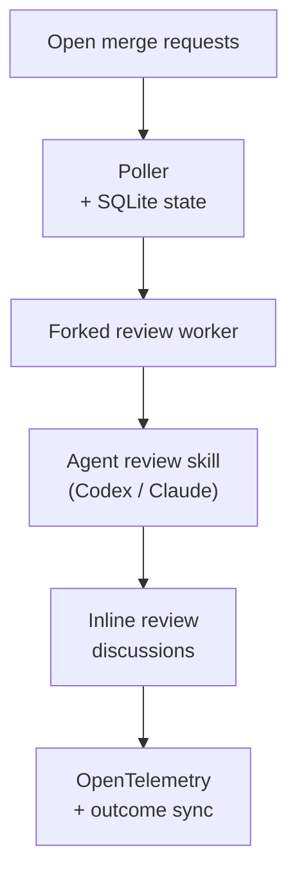

# Bubo 🦉

> **Agentic AI code review — with the LLM of your choice.**

[](pyproject.toml)
[](pyproject.toml)
[](https://github.com/mountainowl/ai-code-review/actions/workflows/ci.yml)
[](https://scorecard.dev/viewer/?uri=github.com/mountainowl/ai-code-review)
[](docs/telemetry.md)
[](LICENSE)

Bubo is an **agentic AI code reviewer** for GitLab MRs and GitHub PRs. It watches
open changes, runs a structured agentic review with **the LLM you choose** (Codex,
Claude, or any model your CLI drives), and posts only actionable findings as inline
review threads — no chatbot noise, no praise, no summaries. Like the owl it's named
for, it stays silent until it has something worth saying.


---

## Example output

The bot posts inline review threads in a fixed shape — `Issue` / `Impact` /
`Evidence` / `Fix` / `Confidence`:

```text
Issue: HS256 JWT fallback is skipped when Cognito URL construction fails.
Impact: Valid local/shared-secret JWT requests return 500 instead of authenticating.
Evidence: The changed interceptor rethrows InvalidAwsUrlException before fallback runs.
Fix: Treat Cognito validation construction failures as failed Cognito auth when fallback is allowed.
Confidence: 0.94
```

When a review finds nothing actionable, the bot posts a single
change-level acknowledgement so a clean MR/PR is distinguishable from
one the reviewer never touched:

```text
Automated review ran — no issues found.
```

This is idempotent on exact body match scoped to the bot's author — re-reviews
on rebases or repeated polls reuse the existing comment. Default-on; configure
or disable under `[agents]` (see the [configuration reference](docs/configuration.md)).

Real (sanitized) inline findings on GitLab MRs:


More sanitized examples are in [docs/examples/README.md](docs/examples/README.md).
Demo GIF: [docs/media/bubo-demo.gif](docs/media/bubo-demo.gif).

---

## 60-second quickstart

Install prereqs (uv, Python 3.14+, Git, plus the CLI for your SCM and a
Codex/Claude agent — see [prerequisites](docs/prerequisites.md) for the
copy-paste blocks), then:

```sh
uv tool install git+https://github.com/mountainowl/ai-code-review@v0.6.0
bubo init                # idempotent; --dry-run to preview

# Edit ~/.local/share/bubo/config/env.toml:
#   [gitlab].token, [agents].llm_api_key, [agents].llm_model,
#   and at least one [[projects]] entry.

bubo doctor              # verify before first poll
bubo-poller                 # one poll cycle; exits at the end
```

The first cycle runs with `[review].dry_run = true` (the default) — findings
are planned but no comments are posted. Flip to `false` once a real review
looks right. For the full install + bot-account walkthrough, see
[install and configure](docs/install-and-configure.md). For poller flags
and the bundled MCP server, see [run](docs/run.md).

---

## How it works



1. The poller lists open MRs for each configured project, skipping any it has
   already reviewed at the current head SHA.
2. For each eligible MR it forks a worker. The worker checks out the MR diff,
   runs the agent review skill, and parses structured findings.
3. Each finding is mapped to a changed line in the MR diff and posted as an
   inline GitLab review thread (or stored as a "planned" finding if
   `dry_run` is on).
4. If a review finishes with zero findings, the worker posts a single
   change-level acknowledgement comment (the no-findings comment) so
   reviewer-ran-and-passed is distinguishable from reviewer-never-ran.
   Default-on, dedup'd by bot author + exact body; honors `dry_run`;
   a failure to post the acknowledgement is a soft error that does NOT
   flip the underlying clean review to `FAILED`.
5. SQLite records reviewed SHAs and posted-finding fingerprints so the bot
   does not spam the same MR or duplicate a comment.
6. `--sync-outcomes` later checks which posted findings were resolved,
   replied to, marked false-positive, deleted, or merged-unresolved.

The poller does not try to be a code-review brain. It orchestrates SCM access,
state, prompt rendering, posting, and metrics. The actual review logic lives
in the configured CLI skill.

---

## Further reading

| Doc | What's in it |
|---|---|
| [Prerequisites](docs/prerequisites.md) | macOS / Linux runtime, per-provider tools, credentials, install verification. |
| [Install and configure](docs/install-and-configure.md) | `uv tool install`, `bubo init`, the minimum `config/env.toml`, GitLab and GitHub bot setup. |
| [Run](docs/run.md) | One-off review, the GitLab poller, the bundled `bubo-mcp` MCP server (three deployment patterns) and upstream wrappers. |
| [Configuration reference](docs/configuration.md) | Every `[scm]` / `[gitlab]` / `[github]` / `[review]` / `[poller]` / `[agents]` / `[telemetry]` / `[[projects]]` setting and its default. |
| [Operate](docs/operate.md) | Remote deploy, scheduling under cron or systemd, `--sync-outcomes` grading, one-shot backfill. |
| [Telemetry](docs/telemetry.md) | Emitted `llm_review.*` metrics, ready-made dashboard queries, cardinality discipline. |

---

## Status and roadmap

- **GitLab posting via polling** — production path. Stable.
- **GitHub posting via polling** — supported, at outcome-metric parity with
  GitLab. Set `[scm].provider = "github"` (or run `bubo-gh-poller`, which
  forces it). See [how the GitHub provider talks to GitHub](docs/run.md#how-the-github-provider-talks-to-github)
  for the MCP/REST + GraphQL details.
- **Webhook-driven triggering** — not implemented; polling is the only path.
- **pip-only install** — not supported. The install needs the bundled prompt, skill, config template, wrapper scripts, and deployment templates that ship with the checkout.

Review execution is intentionally outside CI/CD. Run it as a poller beside your existing pipelines.

---

## Security

- `config/env.toml` is gitignored and holds tokens. **Do not print or commit
  real values from it.**
- Review-agent stdout is redacted (`GITLAB_TOKEN=`, `OPENAI_API_KEY=`, `glpat-…`,
  `sk-…`, and credentialed Git URLs) before being written to reports, logs, or
  the database error column.
- The reviewer subprocess is launched with a strict env allowlist (see
  `REVIEWER_ENV_ALLOWLIST` in `src/bubo/poller.py`) — host secrets are
  not passed wholesale into the LLM agent.
- Report vulnerabilities per [`SECURITY.md`](SECURITY.md).

---

## Bot avatar

Upload [`assets/bubo.png`](assets/bubo.png) as the GitLab (or
future GitHub) bot avatar.


---

## Community

- [Contributing](CONTRIBUTING.md)
- [Security policy](SECURITY.md)
- [Support](SUPPORT.md)
- [Code of conduct](CODE_OF_CONDUCT.md)
