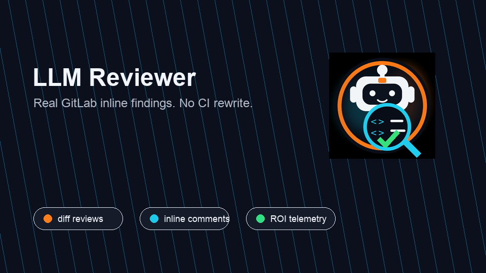
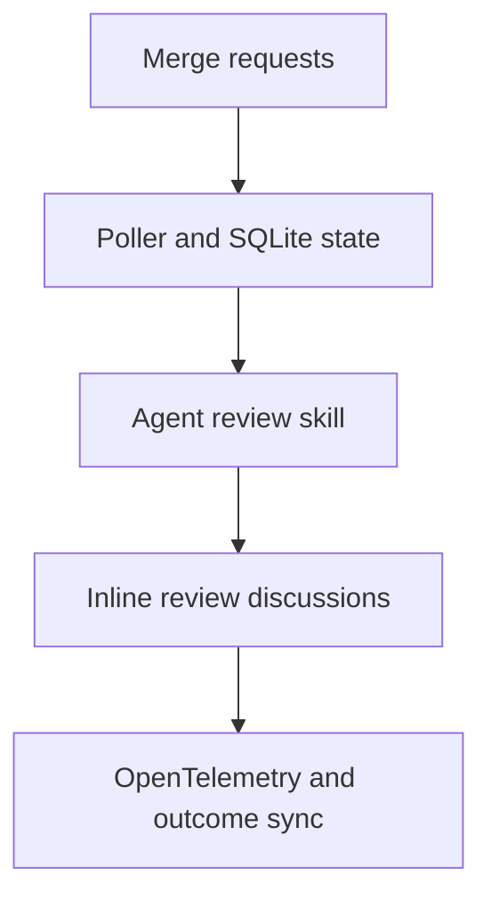

# Automated AI Based Code Reviewer

[](pyproject.toml)
[](pyproject.toml)
[](https://github.com/mountainowl/ai-code-review/actions/workflows/ci.yml)
[](https://scorecard.dev/viewer/?uri=github.com/mountainowl/ai-code-review)
[](#project-status)
[](#telemetry-and-roi)
[](LICENSE)

Evidence-backed LLM code review for merge requests.


LLM Reviewer watches merge requests, runs a structured agent review, and posts
only actionable findings as inline review discussions. It is built for teams
that want early review signal without turning every MR into a chatbot thread.

## Demo



## Project Status

GitLab-first. Small by design. Production path: polling plus inline review
threads. Not primary yet: webhooks, GitHub posting, or pip-only installs without
checked-out assets.

Review execution is intentionally outside CI/CD. Run it as a poller beside your
existing pipelines.

## Why Teams Use It

- **Inline comments, not summaries.** Findings are mapped back to changed lines.
- **Evidence-first reviews.** The prompt requires impact, evidence, fix, and
  confidence before a finding is allowed through.
- **Human-friendly tone.** Short, direct comments. No praise, filler, broad
  audits, or style nits.
- **Stateful and idempotent.** SQLite records reviewed SHAs and posted
  fingerprints so the bot does not spam the same MR.
- **Ops-ready metrics.** OpenTelemetry reports reviews, findings, failures,
  tokens, estimated cost, and resolution outcomes.
- **Plain deployment.** A small Python package plus shell wrappers. No Docker
  requirement.
- **Fits beside existing CI/CD.** Start with polling and inline comments without
  rewriting pipelines.

## What It Does



The poller does not try to be a code-review brain. It orchestrates SCM access,
state, prompt rendering, posting, and metrics. The actual review runs through
the configured CLI skill.

## Review Format

The bot comments in a predictable shape:

```text
Issue: HS256 JWT fallback is skipped when Cognito URL construction fails.
Impact: Valid local/shared-secret JWT requests return 500 instead of authenticating.
Evidence: The changed interceptor rethrows InvalidAwsUrlException before fallback runs.
Fix: Treat Cognito validation construction failures as failed Cognito auth when fallback is allowed.
Confidence: 0.94
```

Sanitized real inline findings:


More sanitized examples are in [docs/examples](docs/examples/README.md).

## Prerequisites

- Python 3.14 or newer.
- `uv`.
- Git CLI.
- GitLab token with `api` scope.
- Codex CLI or Claude CLI configured on the review host.

## Quick Start

Install from a checkout so the prompt, skill, config template, wrapper scripts,
and deployment templates stay together:

```sh
git clone https://github.com/mountainowl/ai-code-review.git
cd ai-code-review
./scripts/install-package.sh
```

For local development:

```sh
git clone https://github.com/mountainowl/ai-code-review.git
cd ai-code-review
uv sync --dev
uv run pytest
```

Create local config:

```sh
cp config/env.example.toml config/env.toml
```

Add your GitLab and model credentials to the `[secrets]` table in
`config/env.toml`:

```toml
[secrets]
gitlab_token = "..."
openai_api_key = "..."
```

Run a one-off Codex review from the current checkout:

```sh
uv run code-review-codex "Review the current changes."
```

Run the GitLab poller:

```sh
uv run mr-review-poller
```

## GitLab Setup

1. Create a bot user such as `llm-reviewer`.
2. Add it to the target GitLab projects with permission to read MRs and create
   discussions.
3. Create a token with `api` scope.
4. Put the token in ignored `config/env.toml`.
5. Add projects to ignored `config/env.toml`.

Keep `dry_run = true` under `[review]` until the first review output looks right.

## Configuration

Public defaults live in `config/env.example.toml`. Copy it to ignored
`config/env.toml` before running. Runtime config and secrets live in that one
TOML file.

<table>
  <thead>
    <tr>
      <th>Setting</th>
      <th>Default</th>
      <th>Purpose / impact</th>
    </tr>
  </thead>
  <tbody>
    <tr><th colspan="3"><code>[gitlab]</code></th></tr>
    <tr>
      <td><code>url</code></td>
      <td><code>https://gitlab.com</code></td>
      <td>Web host the poller reads MRs from. For self-hosted GitLab, keep <code>api_url</code> on the same host.</td>
    </tr>
    <tr>
      <td><code>api_url</code></td>
      <td><code>https://gitlab.com/api/v4</code></td>
      <td>API endpoint used by MCP tools inside the review agent.</td>
    </tr>
    <tr>
      <td><code>bot_username</code></td>
      <td><code>llm-reviewer</code></td>
      <td>Lets outcome sync separate bot comments from developer replies.</td>
    </tr>
    <tr>
      <td><code>denied_tools_regex</code></td>
      <td><code>^(delete_.*|merge_merge_request|push_files)$</code></td>
      <td>Blocks dangerous GitLab MCP tools even if the agent can see them.</td>
    </tr>
    <tr><th colspan="3"><code>[review]</code></th></tr>
    <tr>
      <td><code>dry_run</code></td>
      <td><code>true</code></td>
      <td>Stores planned findings without posting comments. Set <code>false</code> after test reviews look right.</td>
    </tr>
    <tr>
      <td><code>max_merge_requests_per_poll</code></td>
      <td><code>8</code></td>
      <td>Caps how many MRs one poll cycle queues. Higher values can start more workers.</td>
    </tr>
    <tr>
      <td><code>max_findings_per_merge_request</code></td>
      <td><code>8</code></td>
      <td>Caps findings per MR and fills <code>{{MAX_FINDINGS_PER_REVIEW}}</code> in the prompt.</td>
    </tr>
    <tr>
      <td><code>timeout_seconds</code></td>
      <td><code>1800</code></td>
      <td>Kills a review worker that runs too long.</td>
    </tr>
    <tr><th colspan="3"><code>[poller]</code></th></tr>
    <tr>
      <td><code>state_dir</code></td>
      <td><code>var</code></td>
      <td>Stores SQLite state, logs, reports, worktrees, and rendered prompts.</td>
    </tr>
    <tr>
      <td><code>interval_seconds</code></td>
      <td><code>900</code></td>
      <td>Suggested wait for long-running poll loops. Cron/systemd can use another interval.</td>
    </tr>
    <tr>
      <td><code>target_merge_request_iid</code></td>
      <td>unset</td>
      <td>Temporary single-MR filter. Leave unset in production.</td>
    </tr>
    <tr><th colspan="3"><code>[agent]</code></th></tr>
    <tr>
      <td><code>prompt_file</code></td>
      <td><code>prompts/00-meta.md</code></td>
      <td>Meta prompt rendered before each review.</td>
    </tr>
    <tr>
      <td><code>model</code></td>
      <td><code>gpt-5.5</code></td>
      <td>Model passed to the review wrapper. Keep telemetry pricing aligned for cost metrics.</td>
    </tr>
    <tr>
      <td><code>reasoning_effort</code></td>
      <td><code>medium</code></td>
      <td>Review reasoning level. Higher values can cost more and run longer.</td>
    </tr>
    <tr>
      <td><code>manual_review_dry_run</code></td>
      <td><code>true</code></td>
      <td>Dry-run default for manual wrappers, separate from poller posting.</td>
    </tr>
    <tr>
      <td><code>codex_profile</code></td>
      <td><code>llm-reviewer</code></td>
      <td>Codex profile used by the Codex wrapper.</td>
    </tr>
    <tr>
      <td><code>codex_sandbox</code></td>
      <td><code>read-only</code></td>
      <td>Filesystem access passed to Codex review runs.</td>
    </tr>
    <tr><th colspan="3"><code>[secrets]</code></th></tr>
    <tr>
      <td><code>gitlab_token</code></td>
      <td>unset</td>
      <td>GitLab token with <code>api</code> scope. Exported as <code>GITLAB_TOKEN</code> and <code>GITLAB_PERSONAL_ACCESS_TOKEN</code>.</td>
    </tr>
    <tr>
      <td><code>openai_api_key</code></td>
      <td>unset</td>
      <td>OpenAI key for Codex-backed reviews. Exported as <code>OPENAI_API_KEY</code>.</td>
    </tr>
    <tr>
      <td><code>anthropic_api_key</code></td>
      <td>unset</td>
      <td>Anthropic key for Claude-backed reviews. Exported as <code>ANTHROPIC_API_KEY</code>.</td>
    </tr>
    <tr>
      <td><code>qwen_api_key</code></td>
      <td>unset</td>
      <td>Optional Qwen key for custom wrappers. Exported as <code>QWEN_API_KEY</code>.</td>
    </tr>
    <tr><th colspan="3"><code>[telemetry]</code></th></tr>
    <tr>
      <td><code>enabled</code></td>
      <td><code>false</code></td>
      <td>Sends OTel metrics and spans when enabled. SQLite state is still written either way.</td>
    </tr>
    <tr>
      <td><code>service_name</code></td>
      <td><code>llm-reviewer</code></td>
      <td>Service name shown in the OTel backend.</td>
    </tr>
    <tr>
      <td><code>environment</code></td>
      <td><code>prod</code></td>
      <td>Environment label for dashboards, such as <code>dev</code>, <code>staging</code>, or <code>prod</code>.</td>
    </tr>
    <tr>
      <td><code>otlp_endpoint</code></td>
      <td><code>http://127.0.0.1:4317</code></td>
      <td>Collector endpoint for metrics and traces.</td>
    </tr>
    <tr>
      <td><code>otlp_protocol</code></td>
      <td><code>grpc</code></td>
      <td>OTLP transport. Only <code>grpc</code> is supported today.</td>
    </tr>
    <tr>
      <td><code>export_interval_seconds</code></td>
      <td><code>30</code></td>
      <td>Metric export interval. Lower values make dashboards fresher.</td>
    </tr>
    <tr>
      <td><code>emit_finding_events</code></td>
      <td><code>true</code></td>
      <td>Emits finding lifecycle metrics like planned, posted, skipped, and resolved.</td>
    </tr>
    <tr>
      <td><code>emit_outcome_sync</code></td>
      <td><code>true</code></td>
      <td>Emits metrics when outcome sync checks posted finding status.</td>
    </tr>
    <tr><th colspan="3"><code>[telemetry.pricing.default]</code></th></tr>
    <tr>
      <td><code>input_per_1m</code></td>
      <td><code>0.0</code></td>
      <td>Estimated input-token price per million tokens for cost metrics.</td>
    </tr>
    <tr>
      <td><code>output_per_1m</code></td>
      <td><code>0.0</code></td>
      <td>Estimated output-token price per million tokens for cost metrics.</td>
    </tr>
    <tr>
      <td><code>cached_input_per_1m</code></td>
      <td><code>0.0</code></td>
      <td>Estimated cached-input price per million tokens for cost metrics.</td>
    </tr>
    <tr><th colspan="3"><code>[[projects]]</code></th></tr>
    <tr>
      <td><code>path</code></td>
      <td>sample repos</td>
      <td>GitLab project path to poll, for example <code>group/repo</code>.</td>
    </tr>
    <tr>
      <td><code>enabled</code></td>
      <td><code>true</code></td>
      <td>Turns polling for that project on or off.</td>
    </tr>
  </tbody>
</table>

## Deploy

Push the package to a host:

```sh
./scripts/deploy-package.sh user@host
```

That installs under `$HOME/.local/share/llm-reviewer`, runs
`uv sync --locked --no-dev`, and initializes SQLite state.

Common options:

```sh
# install to a custom root
./scripts/deploy-package.sh user@host --root /opt/llm-reviewer

# elevate when the root needs root-owned writes
./scripts/deploy-package.sh user@host --sudo --root /opt/llm-reviewer

# also install Codex and Claude config templates
./scripts/deploy-package.sh user@host --install-agent-config
```

For a host-local install after copying the checkout yourself:

```sh
./scripts/install-package.sh
```

The wrappers in `bin/` infer the install root from their own location and load
`config/env.toml`. No activation step is needed.

## Telemetry And ROI

LLM Reviewer emits OpenTelemetry metrics and spans so rollups stay outside the
poller. Useful dashboard slices:

- MRs reviewed, skipped, failed, and posted.
- Findings planned, posted, skipped, resolved, disputed, or deleted.
- Review latency, queue latency, and worker runtime.
- Input, output, cached, and total tokens.
- Estimated model cost per review, repo, finding, and resolved finding.
- Failure counts by component: GitLab, Codex, Claude, MCP, parser, posting.

Outcome sync checks posted GitLab discussions later:

```sh
bin/mr-review-poller --sync-outcomes
```

That records whether each finding was resolved, left unresolved after merge,
deleted, replied to, marked disputed, marked false-positive, or marked duplicate.

## Bot Avatar

Use `assets/llm-reviewer.png` as the GitLab or GitHub bot avatar.


## Community

- [Contributing](CONTRIBUTING.md)
- [Security policy](SECURITY.md)
- [Support](SUPPORT.md)
- [Code of conduct](CODE_OF_CONDUCT.md)

## Safety

Do not print or commit real values from `config/env.toml`.

Ignored local files:

- `config/env.toml`
