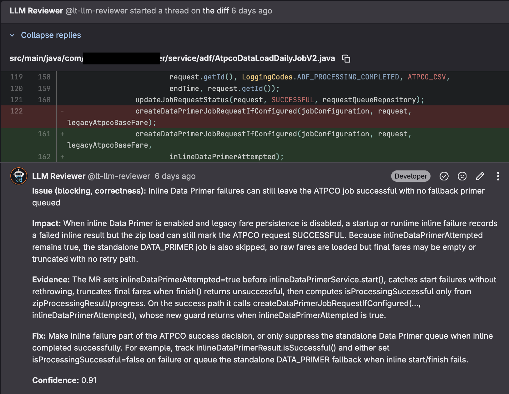
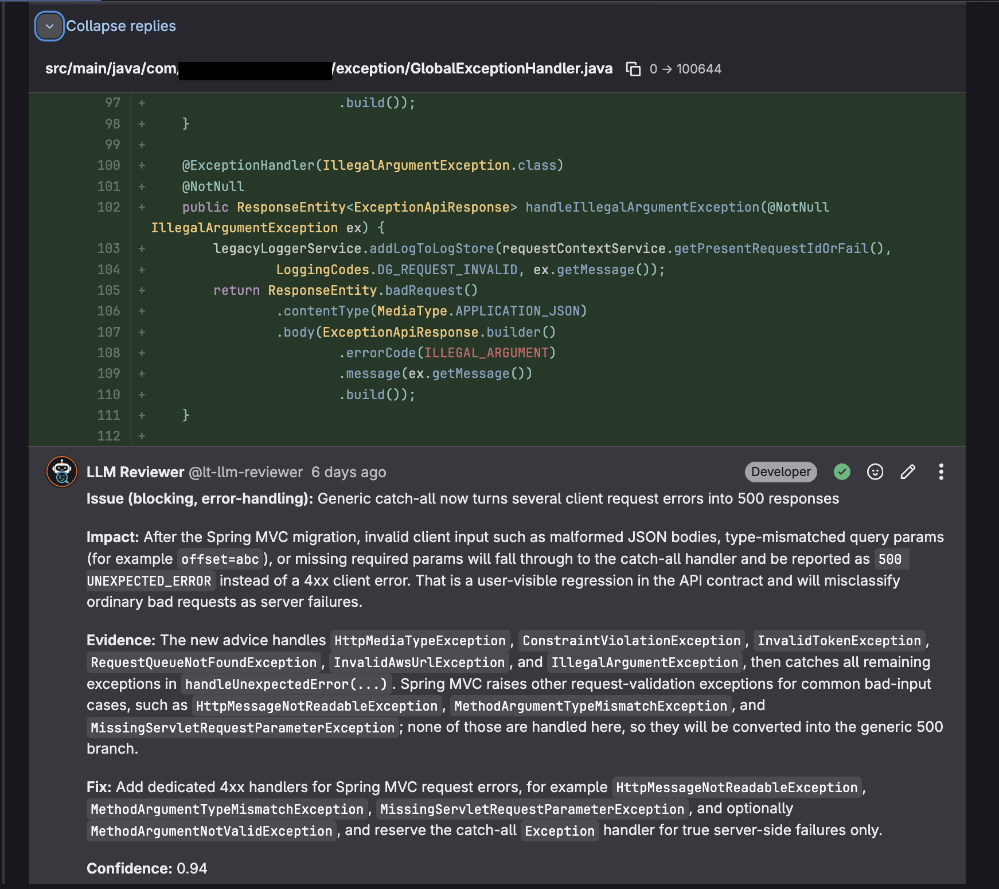
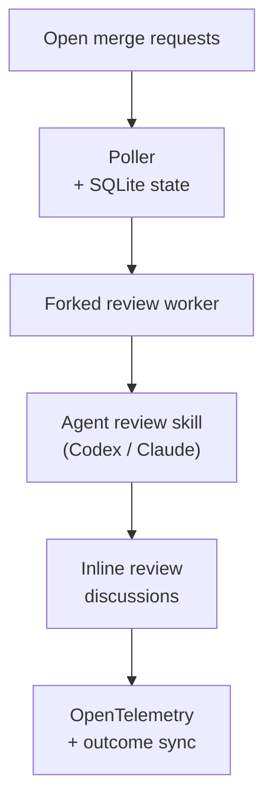

# Automated AI Based Code Reviewer

[](pyproject.toml)
[](pyproject.toml)
[](https://github.com/mountainowl/ai-code-review/actions/workflows/ci.yml)
[](https://scorecard.dev/viewer/?uri=github.com/mountainowl/ai-code-review)
[](#telemetry)
[](LICENSE)

Evidence-backed LLM code review for merge requests. Watches GitLab MRs, runs a
structured agent review, and posts only actionable findings as inline review
threads — no chatbot noise, no praise, no summaries.


---

## Table of contents

1. [Example output](#example-output)
2. [Prerequisites](#prerequisites)
3. [Install](#install)
4. [Configure](#configure)
5. [Run](#run)
6. [How it works](#how-it-works)
7. [Configuration reference](#configuration-reference)
8. [Operate](#operate)
9. [Telemetry](#telemetry)
10. [Status and roadmap](#status-and-roadmap)
11. [Security](#security)
12. [Bot avatar](#bot-avatar)
13. [Community](#community)

---

## Example output

The bot posts inline review threads in a fixed shape — `Issue` / `Impact` /
`Evidence` / `Fix` / `Confidence`:

```text
Issue: HS256 JWT fallback is skipped when Cognito URL construction fails.
Impact: Valid local/shared-secret JWT requests return 500 instead of authenticating.
Evidence: The changed interceptor rethrows InvalidAwsUrlException before fallback runs.
Fix: Treat Cognito validation construction failures as failed Cognito auth when fallback is allowed.
Confidence: 0.94
```

Real (sanitized) inline findings on GitLab MRs:





More sanitized examples are in [docs/examples/README.md](docs/examples/README.md).
Demo GIF: [docs/media/llm-reviewer-demo.gif](docs/media/llm-reviewer-demo.gif).

---

## Prerequisites

Install these by hand on the review host before the package will run.
Nothing is bundled implicitly — if a tool below is missing, the corresponding
code path fails immediately.

### Runtime — required for any review

| Tool | Why it is required | How to install |
|---|---|---|
| **Python 3.14+** | Runtime. | `uv python install 3.14` or your OS package. |
| **[uv](https://docs.astral.sh/uv/)** | Project + dependency manager. Every CLI script invokes `uv run`. | `curl -LsSf https://astral.sh/uv/install.sh \| sh` |
| **Git CLI** | The worker runs `git fetch` / `git checkout` against change refs. | OS package (`brew install git`, `apt install git`, …). |
| **Codex CLI or Claude CLI** | The configured review agent. Must be installed and authenticated to your LLM provider. | [Codex](https://github.com/openai/codex) or [Claude Code](https://www.anthropic.com/claude-code). |
| **[Superpowers](https://github.com/obra/superpowers) + `code-reviewer` skill** | The review prompt invokes `/using-superpowers` and the `$code-reviewer` skill — without Superpowers configured in your CLI the agent will not run the review contract. | Install Superpowers into your Codex/Claude config. The bundled skill assets live under `plugins/superpowers/` and `skills/code-reviewer/`. |

### Per-provider — required for the provider you enable in `[scm].provider`

| Provider | Tools | How to install |
|---|---|---|
| **GitLab** (`provider = "gitlab"`) | [`glab`](https://gitlab.com/gitlab-org/cli) (clones each MR) + a **GitLab MCP server** on `PATH` as `mcp-gitlab` / `gitlab-mcp` (posts inline threads). | `brew install glab`; `npm install -g @zereight/mcp-gitlab`. |
| **GitHub** (`provider = "github"`) | [`gh`](https://cli.github.com/) (clones each PR) + a **GitHub MCP server** on `PATH` as `github-mcp-server` / `mcp-github` / `gh-mcp-server` (posts inline review comments; falls back to REST if the MCP tool name differs). | `brew install gh`; install [github-mcp-server](https://github.com/github/github-mcp-server). |

### Credentials — required for any review

| Credential | What it does | Notes |
|---|---|---|
| **Bot user + token** | The bot account whose name appears on review threads/comments. | **GitLab:** token with `api` scope. **GitHub:** token with pull-request read+write. Create a dedicated bot account and add it to every reviewed project. |
| **LLM provider API key** | OpenAI, Anthropic, or another provider used by the review CLI. | Exported as `LLM_API_KEY` plus the provider-specific name matched from `[agents].llm_model`. |

### Optional

| Tool | Needed when |
|---|---|
| **OpenTelemetry collector** | You set `[telemetry].enabled = true`. Receives OTLP/gRPC metrics + spans on the configured endpoint. |
| **systemd or cron** | You want the poller to run on a schedule beyond a one-shot invocation. |

---

## Install

Clone the repo and install in place. The install needs the bundled
prompt, skill, config template, wrapper scripts, and deployment templates that ship with the checkout — pip-only installs are not supported.

```sh
git clone https://github.com/mountainowl/ai-code-review.git
cd ai-code-review
./scripts/install-package.sh
```

For a remote host:

```sh
./scripts/deploy-package.sh user@host
# or
./scripts/deploy-package.sh user@host --root /opt/llm-reviewer --sudo
```

For local development:

```sh
uv sync --dev
uv run pytest
```

---

## Configure

Copy the example config and edit it locally — `config/env.toml` is gitignored
and holds your tokens:

```sh
cp config/env.example.toml config/env.toml
```

Minimum changes to get a first review running:

```toml
[gitlab]
token = "glpat-..."          # api scope

[agents]
llm_api_key = "..."          # your LLM provider key
llm_model = "gpt-5.5"        # match what your CLI is configured for

[[projects]]
path = "your-group/your-repo"
enabled = true
```

Keep `[review].dry_run = true` (the default) until your first real review
output looks right — the poller will plan findings without posting comments.

### GitLab bot setup

1. Create a bot user, for example `llm-reviewer`.
2. Add it to every target GitLab project with permission to read MRs and
   create discussions.
3. Create a token with `api` scope.
4. Put the token in ignored `config/env.toml` under `[gitlab].token`.
5. List the projects under `[[projects]]` in the same file.

---

## Run

One-off review of the current checkout (manual; no GitLab interaction beyond
the agent's own MCP calls):

```sh
uv run code-review-codex "Review the current changes."
```

The GitLab poller (one cycle):

```sh
uv run mr-review-poller
```

Schedule it via cron or a systemd timer for continuous operation — there is
deliberately no daemon mode. Each invocation processes up to
`max_merge_requests_per_poll` MRs and exits.

---

## How it works



1. The poller lists open MRs for each configured project, skipping any it has
   already reviewed at the current head SHA.
2. For each eligible MR it forks a worker. The worker checks out the MR diff,
   runs the agent review skill, and parses structured findings.
3. Each finding is mapped to a changed line in the MR diff and posted as an
   inline GitLab review thread (or stored as a "planned" finding if
   `dry_run` is on).
4. SQLite records reviewed SHAs and posted-finding fingerprints so the bot
   does not spam the same MR or duplicate a comment.
5. `--sync-outcomes` later checks which posted findings were resolved,
   replied to, marked false-positive, deleted, or merged-unresolved.

The poller does not try to be a code-review brain. It orchestrates SCM access,
state, prompt rendering, posting, and metrics. The actual review logic lives
in the configured CLI skill.

---

## Configuration reference

Public defaults live in [`config/env.example.toml`](config/env.example.toml).
Copy it to ignored `config/env.toml` before running. Runtime config and
credentials live in that one TOML file.

<table>
  <thead>
    <tr>
      <th>Setting</th>
      <th>Default</th>
      <th>Purpose / impact</th>
    </tr>
  </thead>
  <tbody>
    <tr><th colspan="3"><code>[scm]</code></th></tr>
    <tr>
      <td><code>provider</code></td>
      <td><code>gitlab</code></td>
      <td>Source-control backend: <code>gitlab</code> or <code>github</code>. Selects which provider the poller drives. <code>gh-review-poller</code> forces <code>github</code>.</td>
    </tr>
    <tr><th colspan="3"><code>[gitlab]</code></th></tr>
    <tr>
      <td><code>url</code></td>
      <td><code>https://gitlab.com</code></td>
      <td>Web host the poller reads MRs from. For self-hosted GitLab, keep <code>api_url</code> on the same host.</td>
    </tr>
    <tr>
      <td><code>api_url</code></td>
      <td><code>https://gitlab.com/api/v4</code></td>
      <td>API endpoint used by MCP tools inside the review agent.</td>
    </tr>
    <tr>
      <td><code>bot_username</code></td>
      <td><code>llm-reviewer</code></td>
      <td>Lets outcome sync separate bot comments from developer replies.</td>
    </tr>
    <tr>
      <td><code>denied_tools_regex</code></td>
      <td><code>^(delete_.*|merge_merge_request|push_files)$</code></td>
      <td>Blocks dangerous GitLab MCP tools even if the agent can see them.</td>
    </tr>
    <tr>
      <td><code>token</code></td>
      <td>unset</td>
      <td>GitLab token with <code>api</code> scope. Exported as <code>GITLAB_TOKEN</code>, <code>GITLAB_PERSONAL_ACCESS_TOKEN</code>, and <code>GLAB_TOKEN</code>.</td>
    </tr>
    <tr><th colspan="3"><code>[github]</code></th></tr>
    <tr>
      <td><code>api_url</code></td>
      <td><code>https://api.github.com</code></td>
      <td>REST API base. Use <code>https://&lt;host&gt;/api/v3</code> for GitHub Enterprise Server.</td>
    </tr>
    <tr>
      <td><code>bot_username</code></td>
      <td><code>llm-reviewer</code></td>
      <td>Lets outcome sync separate bot comments from developer replies.</td>
    </tr>
    <tr>
      <td><code>token</code></td>
      <td>unset</td>
      <td>GitHub token with pull-request read+write. Exported as <code>GITHUB_TOKEN</code>, <code>GITHUB_PERSONAL_ACCESS_TOKEN</code>, and <code>GH_TOKEN</code>.</td>
    </tr>
    <tr><th colspan="3"><code>[review]</code></th></tr>
    <tr>
      <td><code>dry_run</code></td>
      <td><code>true</code></td>
      <td>Stores planned findings without posting comments. Set <code>false</code> after test reviews look right.</td>
    </tr>
    <tr>
      <td><code>max_merge_requests_per_poll</code></td>
      <td><code>8</code></td>
      <td>Caps how many MRs one poll cycle queues. Higher values can fork more workers at once.</td>
    </tr>
    <tr>
      <td><code>max_findings_per_merge_request</code></td>
      <td><code>8</code></td>
      <td>Caps findings per MR and fills <code>{{MAX_FINDINGS_PER_REVIEW}}</code> in the prompt.</td>
    </tr>
    <tr>
      <td><code>timeout_seconds</code></td>
      <td><code>1800</code></td>
      <td>Kills a review worker that runs too long.</td>
    </tr>
    <tr>
      <td><code>min_confidence</code></td>
      <td><code>0.85</code></td>
      <td>Floor for the LLM's per-finding confidence (0.0–1.0). Findings below this score are dropped before posting or planning. Inclusive on the high side.</td>
    </tr>
    <tr>
      <td><code>allowed_kinds</code></td>
      <td><code>[]</code></td>
      <td>Whitelist of finding kinds to post. A finding is kept if its <code>severity</code>, <code>category</code>, or <code>type</code> appears here (case-insensitive). Empty list = no kind filter — post everything that clears <code>min_confidence</code>. Common values: <code>"blocking"</code>, <code>"non-blocking"</code>, <code>"security"</code>, <code>"correctness"</code>, <code>"performance"</code>, <code>"issue"</code>, <code>"suggestion"</code>.</td>
    </tr>
    <tr><th colspan="3"><code>[poller]</code></th></tr>
    <tr>
      <td><code>state_dir</code></td>
      <td><code>var</code></td>
      <td>Stores SQLite state, logs, reports, worktrees, and rendered prompts.</td>
    </tr>
    <tr>
      <td><code>interval_seconds</code></td>
      <td><code>900</code></td>
      <td>Suggested wait for long-running poll loops. Cron/systemd can use another interval.</td>
    </tr>
    <tr>
      <td><code>target_merge_request_iid</code></td>
      <td>unset</td>
      <td>Temporary single-MR filter. Leave unset in production.</td>
    </tr>
    <tr><th colspan="3"><code>[agents]</code></th></tr>
    <tr>
      <td><code>prompt_file</code></td>
      <td><code>prompts/00-meta.md</code></td>
      <td>Meta prompt rendered before each review.</td>
    </tr>
    <tr>
      <td><code>llm_model</code></td>
      <td><code>gpt-5.5</code></td>
      <td>Model passed to the review wrapper. Keep telemetry pricing aligned for cost metrics.</td>
    </tr>
    <tr>
      <td><code>llm_api_key</code></td>
      <td>unset</td>
      <td>LLM provider key. Exported as <code>LLM_API_KEY</code>, <code>OPENAI_API_KEY</code>, <code>ANTHROPIC_API_KEY</code>, and <code>QWEN_API_KEY</code>.</td>
    </tr>
    <tr>
      <td><code>reasoning_effort</code></td>
      <td><code>medium</code></td>
      <td>Review reasoning level. Higher values can cost more and run longer.</td>
    </tr>
    <tr>
      <td><code>dry_run</code></td>
      <td><code>true</code></td>
      <td>Dry-run default for the manual <code>code-review-codex</code> wrapper, separate from <code>[review].dry_run</code> which controls poller posting.</td>
    </tr>
    <tr>
      <td><code>codex_profile</code></td>
      <td><code>llm-reviewer</code></td>
      <td>Codex profile used by the Codex wrapper.</td>
    </tr>
    <tr>
      <td><code>codex_sandbox</code></td>
      <td><code>read-only</code></td>
      <td>Filesystem access passed to Codex review runs.</td>
    </tr>
    <tr><th colspan="3"><code>[telemetry]</code></th></tr>
    <tr>
      <td><code>enabled</code></td>
      <td><code>false</code></td>
      <td>Sends OTel metrics and spans when enabled. SQLite state is still written either way.</td>
    </tr>
    <tr>
      <td><code>service_name</code></td>
      <td><code>llm-reviewer</code></td>
      <td>Service name shown in the OTel backend.</td>
    </tr>
    <tr>
      <td><code>environment</code></td>
      <td><code>prod</code></td>
      <td>Environment label for dashboards, such as <code>dev</code>, <code>staging</code>, or <code>prod</code>.</td>
    </tr>
    <tr>
      <td><code>otlp_endpoint</code></td>
      <td><code>http://127.0.0.1:4317</code></td>
      <td>Collector endpoint for metrics and traces.</td>
    </tr>
    <tr>
      <td><code>otlp_protocol</code></td>
      <td><code>grpc</code></td>
      <td>OTLP transport. Only <code>grpc</code> is supported today.</td>
    </tr>
    <tr>
      <td><code>export_interval_seconds</code></td>
      <td><code>30</code></td>
      <td>Metric export interval. Lower values make dashboards fresher.</td>
    </tr>
    <tr>
      <td><code>emit_finding_events</code></td>
      <td><code>true</code></td>
      <td>Emits finding lifecycle metrics like planned, posted, skipped, and resolved.</td>
    </tr>
    <tr>
      <td><code>emit_outcome_sync</code></td>
      <td><code>true</code></td>
      <td>Emits metrics when outcome sync checks posted finding status.</td>
    </tr>
    <tr>
      <td><code>input_per_1m</code></td>
      <td><code>0.0</code></td>
      <td>Estimated input-token price per million tokens for cost metrics.</td>
    </tr>
    <tr>
      <td><code>output_per_1m</code></td>
      <td><code>0.0</code></td>
      <td>Estimated output-token price per million tokens for cost metrics.</td>
    </tr>
    <tr>
      <td><code>cached_input_per_1m</code></td>
      <td><code>0.0</code></td>
      <td>Estimated cached-input price per million tokens for cost metrics.</td>
    </tr>
    <tr><th colspan="3"><code>[[projects]]</code></th></tr>
    <tr>
      <td><code>path</code></td>
      <td>sample repos</td>
      <td>GitLab project path to poll, for example <code>group/repo</code>.</td>
    </tr>
    <tr>
      <td><code>enabled</code></td>
      <td><code>true</code></td>
      <td>Turns polling for that project on or off.</td>
    </tr>
  </tbody>
</table>

---

## Operate

### Deploy to a host

```sh
./scripts/deploy-package.sh user@host
# installs under $HOME/.local/share/llm-reviewer, runs uv sync --locked --no-dev
```

Custom root or sudo install:

```sh
./scripts/deploy-package.sh user@host --root /opt/llm-reviewer --sudo
./scripts/deploy-package.sh user@host --install-agent-config   # adds Codex/Claude config templates
```

For a host-local install after copying the checkout yourself:

```sh
./scripts/install-package.sh
```

The wrappers in `bin/` infer the install root from their own location and
load `config/env.toml`. No activation step.

### Outcome sync

Once findings have been posted for a while, grade them against GitLab state:

```sh
bin/mr-review-poller --sync-outcomes
```

Records whether each finding was resolved, left unresolved after merge,
deleted, replied to, marked disputed, marked false-positive, or marked
duplicate.

---

## Telemetry

LLM Reviewer emits OpenTelemetry metrics and spans so dashboard rollups stay
outside the poller. Common dashboard slices:

- MRs reviewed, skipped, failed, posted.
- Findings planned, posted, skipped, resolved, disputed, deleted.
- Review latency, queue latency, worker runtime.
- Input, output, cached, and total tokens.
- Estimated model cost per review, repo, finding, and resolved finding.
- Failure counts by component: GitLab, Codex, Claude, MCP, parser, posting.

Metric attributes are kept low-cardinality on purpose — MR IID, SHA, file
path, line number, fingerprint, and discussion ID live in SQLite or span
events only, never as metric labels.

---

## Status and roadmap

- **GitLab posting via polling** — production path. Stable.
- **GitHub posting via polling** — supported. Set `[scm].provider = "github"`
  (or run `gh-review-poller`, which forces it). The poller is
  provider-agnostic: a single :class:`ScmProvider` abstraction drives both
  backends. Two GitHub caveats: inline-comment posting goes through a GitHub
  MCP server with a REST fallback (the MCP tool name varies between server
  implementations and is overrideable via `LLM_REVIEWER_GITHUB_MCP_TOOL`),
  and thread-*resolution* outcome is GitHub-GraphQL-only, so `--sync-outcomes`
  reports GitHub threads as unresolved (developer-replied / disputed /
  deleted / merged-unresolved are still tracked).
- **Webhook-driven triggering** — not implemented; polling is the only path.
- **pip-only install** — not supported. The install needs the bundled prompt,
  skill, config template, wrapper scripts, and deployment templates that ship
  with the checkout.

Review execution is intentionally outside CI/CD. Run it as a poller beside your existing pipelines.

---

## Security

- `config/env.toml` is gitignored and holds tokens. **Do not print or commit
  real values from it.**
- Review-agent stdout is redacted (`GITLAB_TOKEN=`, `OPENAI_API_KEY=`, `glpat-…`,
  `sk-…`, and credentialed Git URLs) before being written to reports, logs, or
  the database error column.
- The reviewer subprocess is launched with a strict env allowlist (see
  `REVIEWER_ENV_ALLOWLIST` in `src/llm_reviewer/poller.py`) — host secrets are
  not passed wholesale into the LLM agent.
- Report vulnerabilities per [`SECURITY.md`](SECURITY.md).

---

## Bot avatar

Upload [`assets/llm-reviewer.png`](assets/llm-reviewer.png) as the GitLab (or
future GitHub) bot avatar.


---

## Community

- [Contributing](CONTRIBUTING.md)
- [Security policy](SECURITY.md)
- [Support](SUPPORT.md)
- [Code of conduct](CODE_OF_CONDUCT.md)
