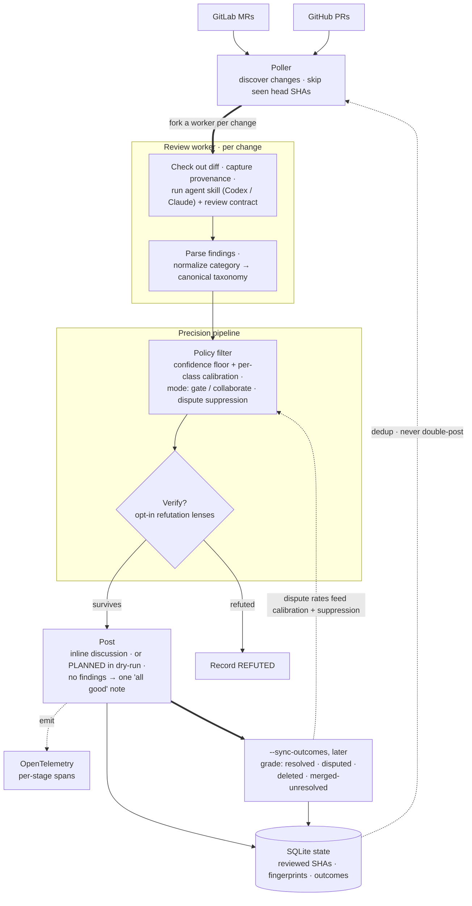

# How it works

Bubo isn't trying to be the code-review brain — it **orchestrates** SCM access,
state, prompting, filtering, posting, and metrics. The review smarts live in your
CLI skill (Codex / Claude); Bubo turns one review into idempotent, inline,
graded, measurable feedback.

## Architecture

Two things the straight-line view hides, and the diagram makes explicit:

- **State closes back on discovery.** SQLite remembers reviewed SHAs and finding
  fingerprints, so the poller skips work it has already done and never
  double-posts.
- **Outcomes close back on precision.** `--sync-outcomes` grades what humans did
  with each finding; those accept/dispute rates feed dispute suppression and
  per-class confidence calibration — so the filter gets sharper on the
  categories *this* team rejects.

## The pipeline, step by step

1. **Discover.** List open MRs/PRs per project, skipping any already reviewed at
   the current head SHA.
2. **Review.** Fork a worker, check out the diff, capture AI-provenance for the
   governance trail, run the agent skill, and parse the findings.
3. **Filter.** Normalize each finding's category to the canonical taxonomy, then
   apply the operator's policy — confidence floor (optionally per-class
   calibrated), the `gate`/`collaborate` surface mode, and dispute suppression.
   Optionally run independent verification lenses; a finding the majority refute
   is recorded `REFUTED` instead of posted.
4. **Post.** Map each surviving finding to a changed line and post it inline — or
   store it as `PLANNED` when `dry_run` is on.
5. **Acknowledge.** Zero findings → one change-level "all good" comment, so
   "reviewed and happy" is distinguishable from "never ran".
6. **Persist.** SQLite records reviewed SHAs and finding fingerprints, so Bubo
   never spams or double-posts across repeated polls.
7. **Grade.** `--sync-outcomes` later checks which findings were resolved,
   replied to, disputed, deleted, or merged unresolved — the signal behind the
   metrics *and* the learning loop above.

## Where the smarts live

Everything above is orchestration: provider access, forking, state, prompt
assembly, the deterministic filter/verify/post path, and telemetry. The actual
review judgment is the **agent skill** you point Bubo at — swap the model or the
skill and the orchestration is unchanged. See
[Configuration reference](configuration.md) for every lever, and
[Metrics & telemetry](telemetry.md) for the spans and outcome grading.
