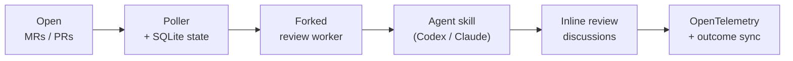

# Bubo 🦉

[](https://pypi.org/project/bubo/)
[](https://github.com/mountainowl/bubo/blob/main/pyproject.toml)
[](https://github.com/mountainowl/bubo/pkgs/container/bubo)
[](https://github.com/mountainowl/bubo/actions/workflows/ci.yml)
[](https://scorecard.dev/viewer/?uri=github.com/mountainowl/bubo)
[](https://github.com/mountainowl/bubo/releases)
[](https://github.com/astral-sh/ruff)
[](https://github.com/astral-sh/uv)
[](https://github.com/mountainowl/bubo/blob/main/LICENSE)

**Agentic AI code review — with the LLM of your choice.**

*Self-hosted · bring-your-own-LLM · GitLab + GitHub · inline findings only ·
governance, provenance & audit · OpenTelemetry metrics*

[Bubo](https://en.wikipedia.org/wiki/Bubo_(genus)) is the genus of the great
horned and eagle owls — patient night hunters that sit silent, see in the dark,
and strike only when they're sure. Code review, same idea: Bubo watches your
diffs, stays quiet through the noise, and speaks only when it finds something
worth the author's time. It runs on the LLM *you* pick, self-hosted, so nothing
leaves your infrastructure — no chatbot chatter, no praise, no summaries.

<div class="grid cards" markdown>

-   :material-silverware-fork-knife:{ .lg .middle } **Copy-paste recipes**

    ---

    GitLab & GitHub setups you can paste and run.

    [:octicons-arrow-right-24: Recipes](recipes.md)

-   :material-rocket-launch:{ .lg .middle } **60-second quickstart**

    ---

    Install, configure, first review — fast.

    [:octicons-arrow-right-24: Get started](install-and-configure.md)

-   :material-github:{ .lg .middle } **Source on GitHub**

    ---

    MIT-licensed, self-hostable, BYO-LLM.

    [:octicons-arrow-right-24: View the repo](https://github.com/mountainowl/bubo)

</div>

---

## Features at a glance

| | |
|---|---|
| 🧠 **Bring your own LLM** | Codex, Claude, or any model your CLI drives — no vendor lock-in. |
| 🔒 **Self-hosted** | Code, diffs, and review data stay on your infrastructure. |
| 🔀 **GitLab + GitHub** | MRs and PRs, one config, identical behavior on both. |
| 🎯 **Signal over noise** | Only actionable inline findings (Issue / Impact / Evidence / Fix / Confidence); one "all good" ack on a clean change. |
| 🎭 **Moods** | Pick the review voice — `terse` / `collaborative` / `socratic` / `formal` / `casual` — without touching the data. |
| 📉 **Learns your taste** | Suppresses finding-classes your team repeatedly disputes. |
| ✅ **Verify before posting** | Optional "is this real?" passes drop findings that don't hold up — point them at a second model for real diversity. |
| 🛡️ **Governance-ready** | AI-code provenance, review-rigor modulation, and an auditable on-prem report (accept rate, ROI, noise trend, latency, policy decisions). |
| 📊 **Observability** | OpenTelemetry metrics; cosign-signed releases with SBOMs. |
| 🔌 **MCP + CI** | Built-in `bubo-mcp` server, and a GitHub Action to review PRs in CI. |

## What it does

Bubo watches the merge/pull requests for the projects in your `config/env.toml`,
forks a worker per change, runs your Codex or Claude review skill against the
diff, and posts each finding as an inline thread. Findings follow a fixed shape:

```text
Issue: HS256 JWT fallback is skipped when Cognito URL construction fails.
Impact: Valid local/shared-secret JWT requests return 500 instead of authenticating.
Evidence: The changed interceptor rethrows InvalidAwsUrlException before fallback runs.
Fix: Treat Cognito validation construction failures as failed Cognito auth when fallback is allowed.
Confidence: 0.94
```

Found nothing? Bubo says so once, so a clean review reads differently from a
review that never ran:

```text
Automated review ran — no issues found.
```

That acknowledgement is dedup'd by exact body and bot author, so rebases and
repeated polls reuse it instead of stacking duplicates.

## How it works



1. **Discover.** List open MRs/PRs per project, skipping any already reviewed at
   the current head SHA.
2. **Review.** Fork a worker, check out the diff, run the agent skill, parse the
   findings.
3. **Post.** Map each finding to a changed line and post it inline — or store it
   as "planned" when `dry_run` is on.
4. **Acknowledge.** Zero findings → one change-level "all good" comment.
5. **Persist.** SQLite remembers reviewed SHAs and finding fingerprints, so Bubo
   never spams or double-posts.
6. **Grade.** `--sync-outcomes` later checks which findings were resolved,
   replied to, disputed, deleted, or merged unresolved.

Bubo isn't trying to be the code-review brain — it orchestrates SCM access,
state, prompting, posting, and metrics. The review smarts live in your CLI skill.

## Install

```sh
uv tool install bubo                          # or: pip install bubo
bubo init                                     # idempotent; --dry-run to preview
bubo doctor                                   # verify before the first poll
bubo-poller                                   # one poll cycle; exits at the end
```

Prefer a container? `docker pull ghcr.io/mountainowl/bubo` (multi-arch; the
review-agent CLI is BYO). Full walkthrough in
**[Install and configure](install-and-configure.md)**.

## Further reading

| Doc | What's in it |
|---|---|
| [Prerequisites](prerequisites.md) | macOS / Linux runtime, per-provider tools, credentials, install verification |
| [Install and configure](install-and-configure.md) | `uv tool install`, `bubo init`, minimum `env.toml`, GitLab and GitHub bot setup |
| [Run](run.md) | One-off review, the poller, the bundled `bubo-mcp` MCP server (three deployment patterns) |
| [Configuration reference](configuration.md) | Every `[scm]` / `[gitlab]` / `[github]` / `[review]` / `[poller]` / `[agents]` / `[telemetry]` / `[[projects]]` setting and its default |
| [Operate](operate.md) | Remote deploy, scheduling under cron or systemd, `--sync-outcomes` grading, one-shot backfill |
| [Telemetry](telemetry.md) | Emitted `llm_review.*` metrics, ready-made dashboard queries, cardinality discipline |

## Project status

- **GitLab posting via polling** — production path. Stable.
- **GitHub posting via polling** — supported, at outcome-metric parity with
  GitLab. Set `[scm].provider = "github"` (or `BUBO_PROVIDER=github`).
- **MCP server (`bubo-mcp`)** — first-class: read-only metrics + triggered
  reviews, over stdio or HTTP.
- **Webhook-driven triggering** — not yet; polling is the only path today.

## Security

- `config/env.toml` is gitignored and holds tokens. **Never print or commit its
  values.**
- Review-agent stdout is redacted (`GITLAB_TOKEN=`, `OPENAI_API_KEY=`, `glpat-…`,
  `sk-…`, credentialed Git URLs) before it touches reports, logs, or the database.
- The reviewer subprocess runs under a strict env allowlist — host secrets aren't
  handed wholesale to the LLM agent.
- Releases are cosign-signed via Sigstore keyless OIDC, with an SBOM (SPDX JSON)
  on every release.
- Report vulnerabilities per
  [SECURITY.md](https://github.com/mountainowl/bubo/blob/main/SECURITY.md).
