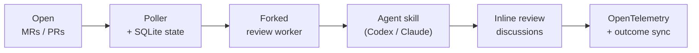

# Bubo 🦉

**Agentic AI code review — with the LLM of your choice.**

Bubo is an agentic AI code reviewer for GitLab MRs and GitHub PRs. It
watches open changes, runs a structured agentic review with the LLM you
choose (Codex, Claude, or any model your CLI drives), and posts only
actionable findings as inline review threads — no chatbot noise, no
praise, no summaries. Like the owl it's named for, it stays silent until
it has something worth saying.


[Copy-paste recipes :material-silverware-fork-knife:](recipes.md){ .md-button .md-button--primary }
[60-second quickstart :material-rocket-launch:](install-and-configure.md){ .md-button }
[Source on GitHub :material-github:](https://github.com/mountainowl/bubo){ .md-button }

---

## What it does

The poller watches open merge requests / pull requests for projects you
list in `config/env.toml`, forks a worker per change, runs a Codex or
Claude review skill against the diff, and posts each structured finding
as an inline review thread. Findings follow a fixed shape:

```text
Issue: HS256 JWT fallback is skipped when Cognito URL construction fails.
Impact: Valid local/shared-secret JWT requests return 500 instead of authenticating.
Evidence: The changed interceptor rethrows InvalidAwsUrlException before fallback runs.
Fix: Treat Cognito validation construction failures as failed Cognito auth when fallback is allowed.
Confidence: 0.94
```

When a review completes with zero actionable findings, it posts a single
change-level acknowledgement so reviewers can distinguish "reviewer ran
and was happy" from "reviewer never ran":

```text
Automated review ran — no issues found.
```

The acknowledgement is dedup'd by exact body match scoped to the bot's
author — re-reviews on rebases or repeated polls reuse the existing
comment instead of stacking duplicates.

## How it works



1. **Discover.** Poller lists open MRs/PRs for each configured project,
   skipping any already reviewed at the current head SHA.
2. **Review.** For each eligible change, it forks a worker that checks
   out the diff, runs the agent review skill, and parses structured
   findings.
3. **Post.** Each finding is mapped to a changed line and posted as an
   inline review thread (or stored as a "planned" finding if `dry_run`
   is on).
4. **Acknowledge.** If a review finishes with zero findings, the worker
   posts a single change-level acknowledgement so a clean MR/PR is
   distinguishable from one the reviewer never touched.
5. **Persist.** SQLite records reviewed SHAs and posted-finding
   fingerprints so the bot does not spam the same MR or duplicate a
   comment.
6. **Grade.** `--sync-outcomes` later checks which posted findings were
   resolved, replied to, marked false-positive, deleted, or
   merged-unresolved.

The poller doesn't try to be a code-review brain. It orchestrates SCM
access, state, prompt rendering, posting, and metrics. The actual
review logic lives in the configured CLI skill.

## Install

```sh
uv tool install git+https://github.com/mountainowl/bubo@v0.8.0
bubo init              # idempotent; --dry-run to preview
bubo doctor            # verify before first poll
bubo-poller            # one poll cycle; exits at the end
```

Full walkthrough in **[Install and configure](install-and-configure.md)**.

## Further reading

| Doc | What's in it |
|---|---|
| [Prerequisites](prerequisites.md) | macOS / Linux runtime, per-provider tools, credentials, install verification |
| [Install and configure](install-and-configure.md) | `uv tool install`, `bubo init`, minimum `env.toml`, GitLab and GitHub bot setup |
| [Run](run.md) | One-off review, the poller, the bundled `bubo-mcp` MCP server (three deployment patterns) |
| [Configuration reference](configuration.md) | Every `[scm]` / `[gitlab]` / `[github]` / `[review]` / `[poller]` / `[agents]` / `[telemetry]` / `[[projects]]` setting and its default |
| [Operate](operate.md) | Remote deploy, scheduling under cron or systemd, `--sync-outcomes` grading, one-shot backfill |
| [Telemetry](telemetry.md) | Emitted `llm_review.*` metrics, ready-made dashboard queries, cardinality discipline |

## Project status

- **GitLab posting via polling** — production path. Stable.
- **GitHub posting via polling** — supported, at outcome-metric parity
  with GitLab. Set `[scm].provider = "github"` or run `bubo-gh-poller`.
- **MCP server (`bubo-mcp`)** — first-class. Two interfaces:
  read-only metrics + triggered reviews. stdio or HTTP transport.
- **Webhook-driven triggering** — not implemented; polling is the only path.

## Security

- `config/env.toml` is gitignored and holds tokens. **Never print or
  commit values from it.**
- Review-agent stdout is redacted (`GITLAB_TOKEN=`, `OPENAI_API_KEY=`,
  `glpat-…`, `sk-…`, and credentialed Git URLs) before being written to
  reports, logs, or the database.
- The reviewer subprocess is launched with a strict env allowlist —
  host secrets are not passed wholesale into the LLM agent.
- Releases are cosign-signed via Sigstore keyless OIDC; SBOM (SPDX
  JSON) attached to every release.
- Report vulnerabilities per
  [SECURITY.md](https://github.com/mountainowl/bubo/blob/main/SECURITY.md).
