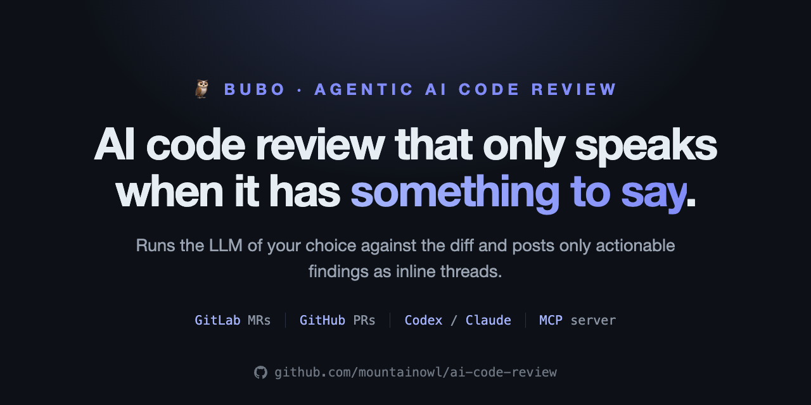
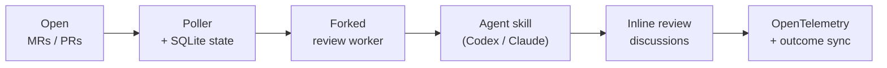

# Bubo 🦉

**Agentic AI code review — with the LLM of your choice.**

Bubo reviews your GitLab MRs and GitHub PRs, posts only the findings worth
acting on, and runs on the LLM *you* pick — self-hosted, so nothing leaves your
infrastructure. Like the owl it's named for, it stays quiet until it has
something worth saying: no chatbot chatter, no praise, no summaries.



[Copy-paste recipes :material-silverware-fork-knife:](recipes.md){ .md-button .md-button--primary }
[60-second quickstart :material-rocket-launch:](install-and-configure.md){ .md-button }
[Source on GitHub :material-github:](https://github.com/mountainowl/bubo){ .md-button }

---

## Features

- **Bring your own LLM.** Codex, Claude, or any model your CLI can drive. No
  vendor lock-in.
- **Self-hosted.** Code, diffs, and review data stay on your infrastructure.
- **GitLab MRs and GitHub PRs**, one config, same behavior on both.
- **Signal over noise.** Only actionable inline findings — Issue / Impact /
  Evidence / Fix / Confidence. A clean change gets one "all good" acknowledgement.
- **Give it a mood.** Pick the review voice — `terse`, `collaborative`,
  `socratic`, `formal`, or `casual` — without touching the underlying data.
- **Learns your team's taste.** Tracks which findings get accepted vs. disputed
  and can suppress the finding-classes you keep rejecting.
- **Verify before posting.** Optional independent "is this real?" passes drop
  findings that don't hold up — point them at a second model for real diversity.
- **Built for governance.** Opt-in AI-code provenance, review-rigor modulation,
  and an auditable on-prem report (accept rate, ROI, noise trend, latency,
  policy decisions) via CLI and MCP.
- **Observability in.** OpenTelemetry metrics; cosign-signed releases with SBOMs.

## What it does

Bubo watches the merge/pull requests for the projects in your `config/env.toml`,
forks a worker per change, runs your Codex or Claude review skill against the
diff, and posts each finding as an inline thread. Findings follow a fixed shape:

```text
Issue: HS256 JWT fallback is skipped when Cognito URL construction fails.
Impact: Valid local/shared-secret JWT requests return 500 instead of authenticating.
Evidence: The changed interceptor rethrows InvalidAwsUrlException before fallback runs.
Fix: Treat Cognito validation construction failures as failed Cognito auth when fallback is allowed.
Confidence: 0.94
```

Found nothing? Bubo says so once, so a clean review reads differently from a
review that never ran:

```text
Automated review ran — no issues found.
```

That acknowledgement is dedup'd by exact body and bot author, so rebases and
repeated polls reuse it instead of stacking duplicates.

## How it works



1. **Discover.** List open MRs/PRs per project, skipping any already reviewed at
   the current head SHA.
2. **Review.** Fork a worker, check out the diff, run the agent skill, parse the
   findings.
3. **Post.** Map each finding to a changed line and post it inline — or store it
   as "planned" when `dry_run` is on.
4. **Acknowledge.** Zero findings → one change-level "all good" comment.
5. **Persist.** SQLite remembers reviewed SHAs and finding fingerprints, so Bubo
   never spams or double-posts.
6. **Grade.** `--sync-outcomes` later checks which findings were resolved,
   replied to, disputed, deleted, or merged unresolved.

Bubo isn't trying to be the code-review brain — it orchestrates SCM access,
state, prompting, posting, and metrics. The review smarts live in your CLI skill.

## Install

```sh
uv tool install bubo                          # or: pip install bubo
bubo init                                     # idempotent; --dry-run to preview
bubo doctor                                   # verify before the first poll
bubo-poller                                   # one poll cycle; exits at the end
```

Prefer a container? `docker pull ghcr.io/mountainowl/bubo` (multi-arch; the
review-agent CLI is BYO). Full walkthrough in
**[Install and configure](install-and-configure.md)**.

## Further reading

| Doc | What's in it |
|---|---|
| [Prerequisites](prerequisites.md) | macOS / Linux runtime, per-provider tools, credentials, install verification |
| [Install and configure](install-and-configure.md) | `uv tool install`, `bubo init`, minimum `env.toml`, GitLab and GitHub bot setup |
| [Run](run.md) | One-off review, the poller, the bundled `bubo-mcp` MCP server (three deployment patterns) |
| [Configuration reference](configuration.md) | Every `[scm]` / `[gitlab]` / `[github]` / `[review]` / `[poller]` / `[agents]` / `[telemetry]` / `[[projects]]` setting and its default |
| [Operate](operate.md) | Remote deploy, scheduling under cron or systemd, `--sync-outcomes` grading, one-shot backfill |
| [Telemetry](telemetry.md) | Emitted `llm_review.*` metrics, ready-made dashboard queries, cardinality discipline |

## Project status

- **GitLab posting via polling** — production path. Stable.
- **GitHub posting via polling** — supported, at outcome-metric parity with
  GitLab. Set `[scm].provider = "github"` (or `BUBO_PROVIDER=github`).
- **MCP server (`bubo-mcp`)** — first-class: read-only metrics + triggered
  reviews, over stdio or HTTP.
- **Webhook-driven triggering** — not yet; polling is the only path today.

## Security

- `config/env.toml` is gitignored and holds tokens. **Never print or commit its
  values.**
- Review-agent stdout is redacted (`GITLAB_TOKEN=`, `OPENAI_API_KEY=`, `glpat-…`,
  `sk-…`, credentialed Git URLs) before it touches reports, logs, or the database.
- The reviewer subprocess runs under a strict env allowlist — host secrets aren't
  handed wholesale to the LLM agent.
- Releases are cosign-signed via Sigstore keyless OIDC, with an SBOM (SPDX JSON)
  on every release.
- Report vulnerabilities per
  [SECURITY.md](https://github.com/mountainowl/bubo/blob/main/SECURITY.md).
